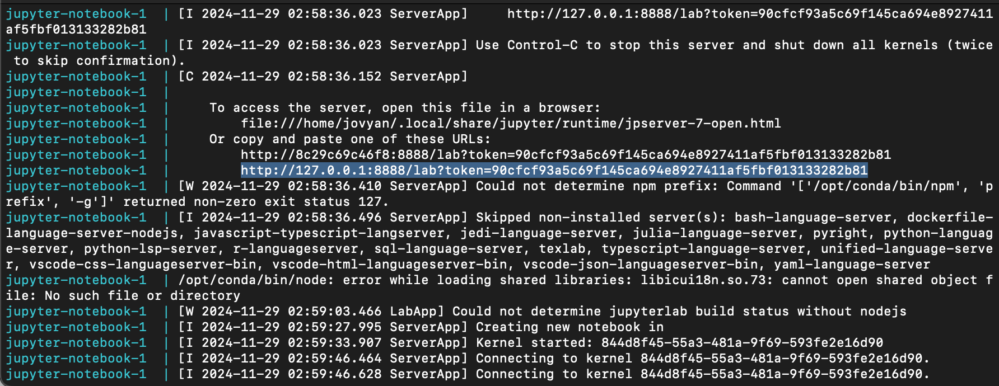

# mushroom_classifier

-   author: Benjamin Frizzell, Hankun Xiao, Yichi Zhang, Mingyang Zhang

This project is part of a data analysis demonstration for DSCI 522 (Data Science Workflows), a course in the Master of Data Science program at the University of British Columbia.

## About

In this project, a Support Vector Classifier was built and tuned to identify mushroom edibility. A mushroom is classified as edible or poisonous based on attributes such as color, habitat, class, and others. The final classifier performed quite well on unseen test data, achieving a final overall accuracy of 0.99 and an F2 (beta = 2) score of 0.99. Furthermore, we used a confusion matrix to evaluate the accuracy of classifying mushrooms as poisonous or edible. The model made 12,174 correct predictions out of 12,214 test observations. However, there were 17 false negatives (predicting a poisonous mushroom as edible) and 23 false positives (predicting an edible mushroom as poisonous). The model’s performance shows promise for practical implementation, prioritizing safety by minimizing false negatives that could result in consuming poisonous mushrooms. While false positives may lead to unnecessarily discarding safe mushrooms, they pose no safety risk. Further development is needed to improve the model’s utility, focusing on enhancing performance and analyzing cases of incorrect predictions.

The dataset used in this project is the Secondary Mushroom Dataset created by Wagner, D., Heider, D., and Hattab, G., from the UCI Machine Learning Repository. This dataset contains 61,069 hypothetical mushrooms with caps based on 173 species (353 mushrooms per species). Each mushroom is identified as definitely edible, definitely poisonous, or of unknown edibility and not recommended (the latter class was combined with the poisonous class).

## Report

The final report can be found [here](https://github.com/UBC-MDS/mushroom_classifier/blob/main/notebooks/Load_Data_and_EDA.ipynb).

## Dependencies

-   [Docker](https://www.docker.com/)
-   [VS Code](https://code.visualstudio.com/download)
-   [VS Code Jupyter Extension](https://marketplace.visualstudio.com/items?itemName=ms-toolsai.jupyter)

## Usage

> Note: this project is fully reproducible using our Docker container

### Before you start

-  Clone the repository to your local machine from GitHub.
-  Launch Docker Desktop and ensure it is running in the background (for Windows and MacOS users).

### To replicate the analysis

1.  Navigate to the root directory of this project in your terminal.
2.  Launch the JupyterLab environment using the following command:

``` bash
docker compose up
```

3.  In the terminal output, find a URL that starts with <http://127.0.0.1:8888/lab?token=...> (see the highlighted text in the terminal below for an example). Copy and paste this URL into your browser. 
**Ensure no other JupyterLab environment is running at the same time.**



4.  To run the analysis, open `notebooks/Load_Data_and_EDA.ipynb` in Jupyter Lab you just launched and under the "Kernel" menu click "Restart Kernel and Run All Cells...".

###  To cxit and clean up the Environment

1.  Press `Ctrl` + `C`, then type `docker compose rm` in the terminal where you launched the container to shut down and clean up the resources..

## Developer notes

### Developer dependencies

-   `conda` (version 24.11.0 or higher)
-   `conda-lock` (version 2.5.7 or higher)

### Adding a new dependency

1.  Add the required dependency to the `environment.yml` file in a new branch.
2.  Use the following command to regenerate the `conda-linux-64.lock` file:

``` bash
conda-lock -k explicit --file environment.yml -p linux-64
```

3.  Locally rebuild the Docker image to confirm that it builds and functions as expected.
4.  Push your updates to GitHub. This will trigger an automated build and push of the new Docker image to Docker Hub, tagged with the SHA of the commit containing the changes.
5.  Update the `docker-compose.yml` file in your branch to reference the new container image, ensuring the tag is correctly updated.
6.  Open a pull request to merge your changes into the `main` branch.

## License

The mushroom_classifier is licensed under:

-   **Codebase**: MIT License. See [LICENSE.md](https://github.com/UBC-MDS/mushroom_classifier/blob/main/LICENSE).

-   **Reports and Visualizations**: Creative Commons Attribution-NonCommercial-NoDerivatives (CC BY-NC-ND 4.0).

## References

Dheeru, D., & Karra Taniskidou, E. (2017). Secondary Mushroom Dataset. UCI Machine Learning Repository. Retrieved from <https://archive.ics.uci.edu/dataset/848/secondary+mushroom+dataset>

Scikit-learn developers. (n.d.). QuantileTransformer. Scikit-learn. Retrieved November 21, 2024, from <https://scikit-learn.org/dev/modules/generated/sklearn.preprocessing.QuantileTransformer.html>

Hunter, J. D. (2007). Matplotlib: A 2D Graphics Environment. Computing in Science & Engineering, 9(3), 90–95.

McKinney, W. (2010). Data Structures for Statistical Computing in Python. Proceedings of the 9th Python in Science Conference, 51–56.

Pedregosa, F., Varoquaux, G., Gramfort, A., Michel, V., Thirion, B., Grisel, O., … Duchesnay, E. (2011). Scikit-learn: Machine Learning in Python. Journal of Machine Learning Research, 12, 2825–2830.

Harris, C. R., Millman, K. J., van der Walt, S. J., Gommers, R., Virtanen, P., Cournapeau, D., … Oliphant, T. E. (2020). Array programming with NumPy. Nature, 585(7825), 357–362.

Virtanen, P., Gommers, R., Oliphant, T. E., Haberland, M., Reddy, T., Cournapeau, D., … van der Walt, S. J. (2020). SciPy 1.0: Fundamental Algorithms for Scientific Computing in Python. Nature Methods, 17, 261–272.
