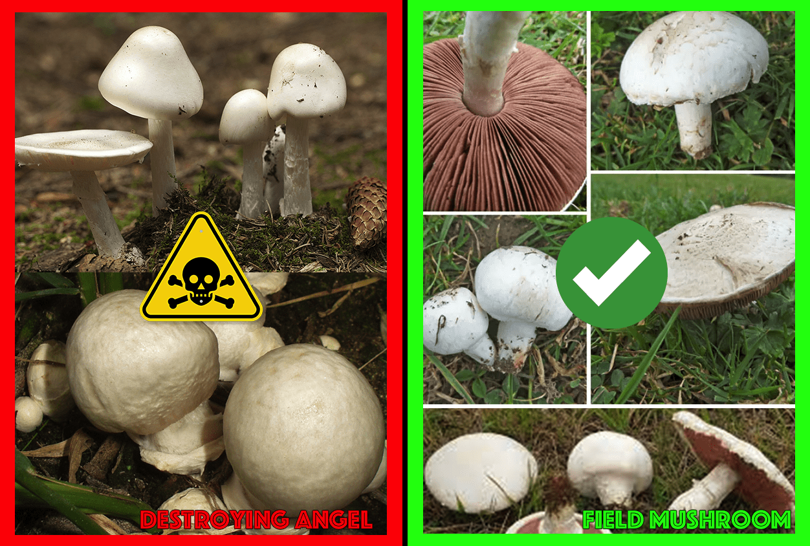
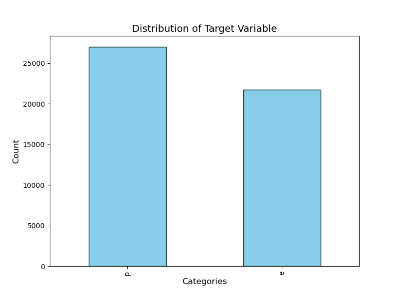
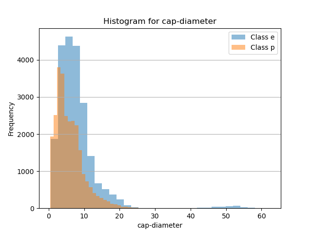
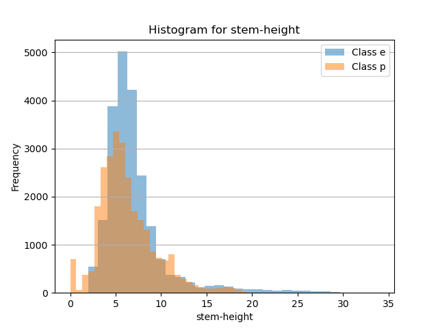
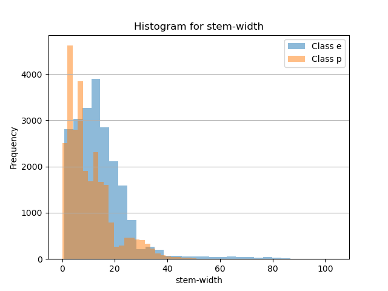
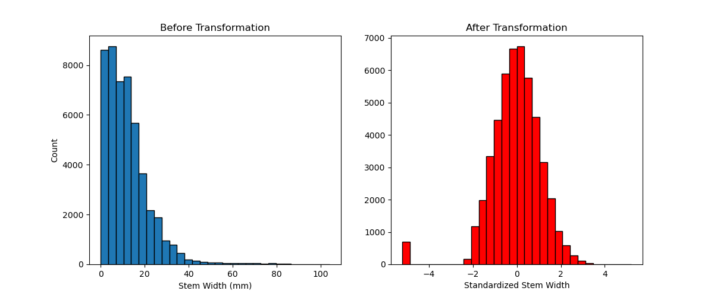

```{python}
# import libraries here

import pandas as pd
from IPython.display import Markdown
from sklearn.preprocessing import OneHotEncoder
import numpy as np
```

## Introduction
### Understanding Mushroom Safety Through Machine Learning

:::: {.columns}

::: {.column width="60%"}
- Mushrooms are nutritious but can be life-threatening.
- Distinguishing edible from poisonous mushrooms is challenging.
- Our solution: A machine learning model focused on safety, minimizing life-threatening false negatives.
:::


::: {.column width="40%"}

:::

::::

---

## Introduction
### Project Goal and Approach
- **Goal**: Build a model to classify mushroom edibility while minimizing false negatives.
- **Dataset**: Over 60,000 mushroom samples categorized by color, structure, and habitat.
- **Approach**:
  - Models: SVC, KNN, Logistic Regression.
  - Priority: Safety (recall and F₂ score emphasized).

---

## Concluding Summary
### Results and Limitations
- **Results**
  - SVC achieved 99.6% accuracy and 99.7% F₂ score.
  - Only 22 false negatives out of 12,181 predictions.
- **Limitations**
  - Biological domain knowledge not integrated.
  - Room to further reduce false negatives.

---

## Concluding Summary
### Future Directions
  - Collaborate with mycologists to identify key biological interactions between mushroom features.
  - Develop a mobile app to make mushroom safety assessments accessible to foragers and farmers.

{width=200px}
{width=200px}

---

## Data Validation
### Summary: 61069 observations and 20 features
### Missing values in some features
```{python}
#| label: missing-values-summary
#| echo: false

total_number_of_observations = 61069
missing_value_summary_df = pd.read_csv("../results/tables/missing_values_by_column.csv")
missing_value_summary_df.rename(columns={'Column': 'Feature', 'Missing Count': '# Missing Value'}, inplace=True)
# Calculate the missing percentage and sort by it in descending order
missing_value_summary_df["Percentage"] = (
    missing_value_summary_df["# Missing Value"] / total_number_of_observations * 100
).round(2).astype(str) + '%'
missing_value_summary_df = missing_value_summary_df.sort_values(by="Percentage", ascending=False)
Markdown(missing_value_summary_df[:5].to_markdown(index = False))
```

---

## Exploratory Data Analysis
:::: {.columns}
::: {.column width="65%"}
<br>

- Target Distribution

- Categorical Features Distribution

- Numerical Features Distribution

:::
::: {.column width="35%"}

:::
::::

---

## Exploratory Data Analysis
### Target Distribution

:::: {.columns}
::: {.column width="60%"}
{width=120%}
:::
::: {.column width="40%"}
<br>

Finding: Balanced Class

- p(poisonous) 55%  
- e(edible) 45%  
:::
::::
---

## Exploratory Data Analysis
### Categorical Features Distribution
:::: {.columns}
::: {.column width="40%"}

**9** Categorical Variables:

- Cap Shape
- Cap Colors
- Bruise or Bleed
- Gill Colors
- ...
:::
::: {.column width="60%"}
_Example: Cap Color Distribution_
```{python}
#| label: tbl-cap-color
#| echo: false

# Mapping of abbreviations to full names
cap_color_mapping = {
    'n': 'brown',
    'b': 'buff',
    'g': 'gray',
    'r': 'green',
    'p': 'pink',
    'u': 'purple',
    'e': 'red',
    'w': 'white',
    'y': 'yellow',
    'l': 'blue',
    'o': 'orange',
    'k': 'black'
}

cap_color_summary_df = pd.read_csv("../results/tables/cap-color_summary.csv")
# Replace abbreviations with full names
cap_color_summary_df['cap-color'] = cap_color_summary_df['cap-color'].replace(cap_color_mapping)
cap_color_summary_df['Proportion'] = (cap_color_summary_df['Proportion'] * 100).round(2).astype(str) + '%'
cap_color_summary_df.rename(columns={'cap-color': 'Cap Color'}, inplace=True)
Markdown(cap_color_summary_df.to_markdown(index = False))
```

:::
::::

---

## Exploratory Data Analysis
### Numerical Features Distribution

:::: {.columns}
::: {.column width="33%"}
{width=120%}
:::
::: {.column width="33%"}
{width=120%}
:::
::: {.column width="33%"}
{width=120%}
:::
::::
## Preprocessing the Data
### Categorical Features

* Many binary and multi-leveled categorical features in our dataset
* Binary features: `does-bruise-or-bleed` and `has-ring`
* Categorical features: color, shape, and habitat
* We are not using Decision Trees, as they tend to show poor performance
compared to other classifiers
* Therefore, we need to transform categories to numeric values

---

## Preprocessing the Data
### One-Hot Encoding

* Simple way to handle both binary and multi-leveled categories
* __dimensionality:__ creates many more columns, might be problematic
---

```{python load-data, echo=false}
# hidden code to load in preprocessor and unprocessed dataset
mushroom_data = pd.read_csv("../data/processed/mushroom_train.csv")
categorical_data = mushroom_data.select_dtypes(exclude=np.float64)
```
### Raw Categorical Data

```{python show-raw, echo=false, interactive=true}
categorical_data.head(3)
```
---

`OneHotEncoder(drop='if_binary', handle_unknown='ignore')`
```{python show-raw, echo=true, interactive=true}
# show effect of OHE on categorical data

ohe = OneHotEncoder(drop='if_binary', handle_unknown='ignore',sparse_output=False)
ohe_df = pd.DataFrame(ohe.fit_transform(categorical_data),dtype=int)

ohe_df.columns = ohe.get_feature_names_out()
ohe_df.head(3)
```

---

## Preprocessing the Data
### Numeric Features

* Numeric features show some skewness
* Models can be sensitive to extreme feature values
* Need an appropriate transformation to handle this

---

## Preprocessing the Data
### Quantile Transformer
1. Map features to empirical quantiles
2. Map quantiles to chosen distribution (eg. Normal or Uniform)

* Outliers become less influential, small differences become 
more pronounced
* Nonlinear transformation, so we lose some interpretability

---

`QuantileTransformer(output_distribution='normal')`


---

## Model Selection

* Logistic Regression: Fast and interpretable, good baseline, probability output to gauge uncertainty
* KNN: Simple, good performance, may struggle with dimensionality
* SVC: Very good performance, lacks interpretability, slow training time

---

## Selecting the Best Model

* We could reasonably use accuracy as we have class balance, but we chose $F_{\beta}$ score:
$$
F_{\beta} = (1 + \beta^2) \times \frac{\text{precision} \times \text{recall}}{\beta^2 \times \text{precision} + \text{recall}}
$$
$\beta = 2$ weighs recall higher than precision, and focuses on 
minimizing false negatives
* Important for classifying mushrooms: we want to **limit consumption of poisonous mushrooms**!

---

## Results
### Model Performance Comparison


* SVC performs the best: ideal choice
* Logistic Regression: suitable alternative for faster training

---

## Results
### SVC Model Evaluation

:::: {.columns}

::: {.column width="60%"}


:::


::: {.column width="40%"}
* 45 mistakes out of 12,181 test samples
* 20 false negatives are the most critical
:::

::::

---

## Limitation and Improvements
* Limitation: Lack of feature engineering
* Future Improvements:
  * Investigating misclassified cases 
  * Integrating domain knowledge

---

## References
- "Edible and Poisonous Mushrooms Side by Side." Mushroom Exam, https://mushroomexam.com/mushroom_look_alikes.html. Accessed January 24, 2025.
- "Mycology Icon" by Freepik, available at Flaticon. Accessed January 24, 2025.
- "Mobile App Icon" by Freepik, available at Flaticon. Accessed January 24, 2025.
- “EDA Magnifier,” generated using Applied Intelligence. Accessed January 25, 2025.

---