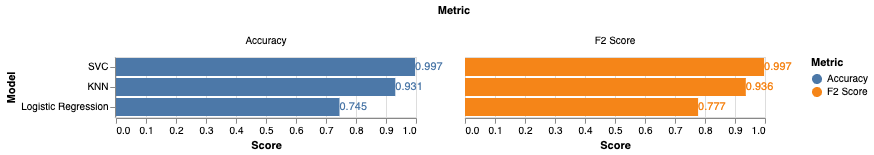
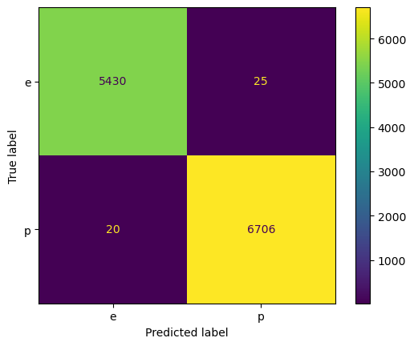

## Summary


---

## Exploratory Data Analysis


---

## Preprocessing the Data
### Categorical Features

* Many binary and multi-leveled categorical features in our dataset
* Binary features: `does-bruise-or-bleed` and `has-ring`
* Categorical features: color, shape, and habitat
* We are not using Decision Trees, as they tend to show poor performance
compared to other classifiers
* Therefore, we need to transform categories to numeric values

---

## Preprocessing the Data
### One-Hot Encoding

* Simple way to handle both binary and multi-leveled categories
* __dimensionality:__ creates many more columns, might be problematic
---

```{python load-data, echo=false}
# hidden code to load in preprocessor and unprocessed dataset
from sklearn.preprocessing import OneHotEncoder
import pandas as pd
import numpy as np
mushroom_data = pd.read_csv("../data/processed/mushroom_train.csv")
categorical_data = mushroom_data.select_dtypes(exclude=np.float64)
```
### Raw Categorical Data

```{python show-raw, echo=false, interactive=true}
categorical_data.head(3)
```
---

`OneHotEncoder(drop='if_binary', handle_unknown='ignore')`
```{python show-raw, echo=false, interactive=true}
# show effect of OHE on categorical data

ohe = OneHotEncoder(drop='if_binary', handle_unknown='ignore',sparse_output=False)
ohe_df = pd.DataFrame(ohe.fit_transform(categorical_data),dtype=int)

ohe_df.columns = ohe.get_feature_names_out()
ohe_df.head(3)
```

---

## Preprocessing the Data
### Numeric Features

* Numeric features show some skewness
* Models can be sensitive to extreme feature values
* Need an appropriate transformation to handle this

---

## Preprocessing the Data
### Quantile Transformer

1. Map features to empirical quantiles
2. Map quantiles to chosen distribution (eg. Normal)

* Outliers become less influential, small differences become 
more pronounced
* Nonlinear transformation, so we lose some interpretability

---

`QuantileTransformer(output_distribution='uniform')`


---

## Model Selection

* Logistic Regression: Fast and interpretable, good baseline, probability output to gauge uncertainty
* KNN: Simple, good performance, may struggle with dimensionality
* SVC: Very good performance, lacks interpretability, slow training time

---

## Selecting the Best Model

* We could reasonably use accuracy as we have class balance, but we chose $F_{\beta}$ score:
$$
F_{\beta} = (1 + \beta^2) \times \frac{\text{precision} \times \text{recall}}{\beta^2 \times \text{precision} + \text{recall}}
$$
$\beta = 2$ weighs recall higher than precision, and focuses on 
minimizing false negatives
* Important for classifying mushrooms: we want to **limit consumption of poisonous mushrooms**!

---

## Results
### Model Performance Comparison


* SVC performs the best: ideal choice
* Logistic Regression: suitable alternative for faster training

---

## Results
### SVC Model Evaluation

:::: {.columns}

::: {.column width="60%"}


:::


::: {.column width="40%"}
* 45 mistakes out of 12,181 test samples
* 20 false negatives are the most critical
:::

::::

---

## Limitation and Improvements
* Limitation: Lack of feature engineering
* Future Improvements:
  * Investigating misclassified cases 
  * Integrating domain knowledge

---
